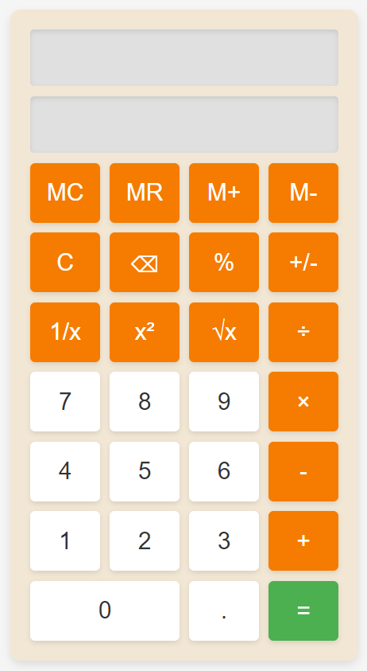

# Simple Calculator

A simple, responsive calculator built using HTML, CSS, and JavaScript. This project includes several basic mathematical operations like addition, subtraction, multiplication, and division, along with advanced features such as square, square root, inverse, and memory functions.

## Features
- Basic operations: Addition, subtraction, multiplication, division
- Advanced operations: Square, square root, inverse
- Memory functions: Memory clear (MC), memory recall (MR), memory add (M+), and memory subtract (M-)
- Responsive design with hover and click animations
- Custom CSS styling for a clean and simple user interface

## Demo

## Installation
1. Clone the repository:
   
   git clone https://github.com/SUBHAJIT-23/Material-Calculator.git

2. Navigate to the project folder:

    cd Material-Calculator

3. Open index.html in your browser to use the calculator.

## How to Use

1. Press the number buttons to input numbers.
2. Use the operators (+, -, ×, ÷) for basic calculations.
3. Use the advanced functions (1/x, x², √x) for more complex operations.
4. Use the memory buttons (MC, MR, M+, M-) to store and recall numbers.
5. Press the = button to get the result of your calculation.

## Styling and Animations

1. Buttons change state on hover and click for a smooth user experience.
2. The calculator features a modern, minimalistic design, with custom background
colors and button animations.